# RepoTether 操作マニュアル

**登録ゼロで、全リポジトリの取り残しと Claude との作業の続きが一目で分かる。**

RepoTether は、ローカルの git リポジトリ、Claude Code のセッション、GitHub / Gogs / Gitea のリポジトリ一覧をまとめて、
「いま何が取り残されているか」「いつ何をやったか」「どこに時間を使っているか」を見るデスクトップアプリです。

- プロジェクトを手で登録しません。探すフォルダとアカウントを決めれば、あとは自動で集まります
- リポジトリは**読むだけ**です。書き込むのは、自分で操作したとき (クローン、safe.directory の追加、任意の git fetch) だけです
- トークンは設定ファイルに書かず、Windows の資格情報マネージャー (macOS はキーチェーン) に置きます

> 画面の画像は、架空のプロジェクトを並べたデモ環境で撮ったものです (`pnpm manual-shots`、[開発者向け](#10-開発者向け-画像の撮り直し) を参照)。

---

## 目次

1. [インストールと起動](#1-インストールと起動)
2. [使い始め](#2-使い始め)
3. [画面の共通部分](#3-画面の共通部分)
4. [状態タブ](#4-状態タブ)
5. [履歴・グラフ・日報タブ](#5-履歴グラフ日報タブ)
6. [設定タブ](#6-設定タブ)
7. [よくある作業](#7-よくある作業)
8. [データの置き場所](#8-データの置き場所)
9. [困ったとき](#9-困ったとき)
10. [開発者向け: 画像の撮り直し](#10-開発者向け-画像の撮り直し)

---

## 1. インストールと起動

[Releases](https://github.com/lancard-aikawa/RepoTether/releases) から、どちらかを入れます (Windows 10 / 11、64 bit)。

| 入れ方 | 起動 |
|---|---|
| インストーラー (`RepoTether_<版>_x64-setup.exe`) | スタートメニューの「RepoTether」 |
| zip (`RepoTether-<版>-win-x64.zip`) | 展開した `RepoTether.exe` をダブルクリック。どこに置いてもよい |

署名していないので、初回は SmartScreen が「PC が保護されました」と出します。「詳細情報」→「実行」で起動してください。

必要なもの:

- `git` コマンド ([Git for Windows](https://gitforwindows.org/))
- 任意: [GitHub CLI](https://cli.github.com/) (`gh`)。GitHub の一覧を、gh のログインで取るとき
- 任意: Claude Code。セッションの履歴を見るとき (`%USERPROFILE%\.claude\projects` を読みます)

起動すると、前回の取り込み結果をすぐに表示し、裏でローカルを読み直します。
初回は Claude Code のログをすべて読むので 30 秒ほどかかります (2 回目からは数秒)。

---

## 2. 使い始め

1. **探す場所** — 起動時は、よくある場所 (`%USERPROFILE%\Repos`、`C:\Repos` など) のうち実在するものを探します。
   ほかにあれば「設定 → 探す場所」で足します ([6. 設定タブ](#6-設定タブ))
2. **自分のコミット** — 「設定 → 自分のコミット」で、自分のメールアドレスを選びます。
   履歴・グラフ・日報は、ここにあるアドレスのコミットだけを数えます。
   GitHub の Web 上でしたコミットは `…@users.noreply.github.com` になるので、候補に出ていれば足してください
3. **リモート (任意)** — 「設定 → アカウント」で GitHub / Gogs / Gitea を足すと、リモートにだけあるリポジトリも並び、クローンできます
4. 「保存して更新」を押します

---

## 3. 画面の共通部分

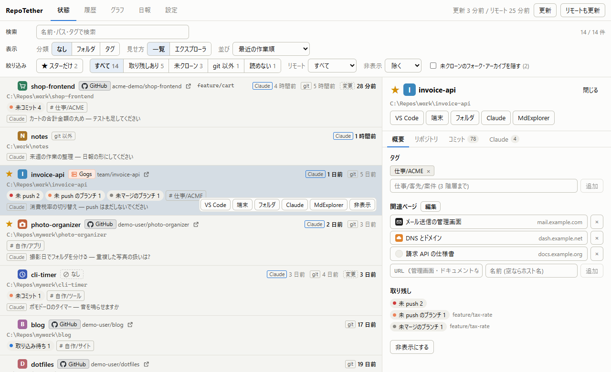

### 上部

| 項目 | 働き |
|---|---|
| 状態 / 履歴 / グラフ / 日報 / 設定 | タブ |
| 更新 ◯分前 / リモート ◯分前 | ローカルとリモートを最後に読んだ時刻。カーソルを乗せると正確な日時 |
| 更新 | ローカル (リポジトリ・コミット・Claude のセッション) をすべて読み直す。状態タブを「フォルダ × エクスプローラ」にして階層を選んでいるときは「◯◯ 以下を更新」(その階層の下だけを読み直す。速い) と「すべて更新」の 2 つになる |
| リモートも更新 | GitHub / Gogs の一覧も取り直す (アカウントを使う設定のときだけ押せる) |

「フォルダ × 一覧」では、フォルダの見出しにカーソルを乗せると出る「この下を更新」でも、その下だけを読み直せます。

自動更新もできます ([表示・その他](#表示その他))。自動更新と起動時は、最近作業したものだけを git から読み直して速くしています。

### 何かを操作したとき

画面の下に短いお知らせが出ます。タグの操作のあとには「元に戻す」ボタンが付きます (約 8 秒)。

---

## 4. 状態タブ

プロジェクトごとの**取り残し**と、最近の作業を一覧にします。

### 操作欄

| 行 | 中身 |
|---|---|
| 検索 | 名前・パス・タグ・リモートで絞る。パスの `\` と `/` は区別しない。右端は「絞った件数 / 全件数」 |
| 表示 | 分類 (なし / フォルダ / タグ) と見せ方 (一覧 / エクスプローラ)、一覧で分類しているときは 📂 すべて開く / 📁 すべて畳む、並び、タグ × 一覧のときは「タグを追加」 |
| 絞り込み | ★ スターだけ、状態、リモートの種類、非表示、未クローンのフォーク・アーカイブを隠す、条件を解除 |

並びは「最近の作業順 / 取り残し・放置が長い順 / 取り残しが重い順 / 名前順」です。
状態の絞り込みは次のとおりです。

| 絞り込み | 対象 |
|---|---|
| 取り残しあり | 未コミット・未 push・未マージのブランチ・stash など、片付けたほうがよいものがある |
| 未クローン | リモートにだけあって、手元に無い |
| git 以外 | git のリポジトリではないが、Claude のセッションがあるフォルダ |
| 読めない | git の所有者チェックで読めない、`.git` が壊れているなど |

### 一行の見方

| 場所 | 中身 |
|---|---|
| ☆ / ★ | スター (お気に入り)。押すと付け外し。付いていないときはカーソルを乗せたときだけ出る |
| アイコン | フォルダの中にアプリのアイコン (下を参照) があればそれ、無ければ名前の頭文字と、名前から決まる色 |
| 名前の横 | リモートの種類 (GitHub / Gogs / Gitea / GitLab / Backlog / その他 / なし) と「所有者/リポジトリ名」。↗ でブラウザを開く。今のブランチが既定と違えばブランチ名 |
| 右端の時刻 | **Claude** = Claude と最後にやりとり、**git** = 自分の最新のコミット、**変更** = 未コミットのファイルの最終更新、**push** = リモートに最後に push された (未クローンなど)。並び替えに使っている一番新しいものが太字 |
| 2 行目 | ローカルのパス |
| バッジ | 取り残し (下の表) と、付けたタグ |
| 最後の行 | 直前の Claude セッションのタイトルと、最後のプロンプト (コンパクト表示では省略) |

アプリのアイコンは、フォルダの中の次の場所から探します (中まで全部はたどらないので、ほかの場所にあるものは拾いません)。

| 探すところ | 例 |
|---|---|
| フレームワークの決まった置き場所 | Tauri の `src-tauri/icons/`、Flutter の `web/icons/`・`assets/icon/`、Android の `mipmap-*/ic_launcher.png`、Electron の `build/icon.png`、Next.js の `app/icon.png`、`public/`・`static/` の favicon など |
| 決まったフォルダの直下の、名前が icon / logo / favicon で始まる画像 | 直下、`assets/`、`resources/`、`images/`、`packaging/`、`.github/`、`docs/` など |
| `icons` フォルダの中の画像 (名前は問わない) | `packaging/icons/app.ico` など |
| リポジトリ名と同じフォルダの中の `static/` など | Python のパッケージの `<名前>/static/icon.svg` など |

画像は PNG / SVG / WebP / ICO / JPEG / GIF の 1 MB までです。アイコンは一度読んだらアプリを閉じるまで覚えておくので、差し替えたときはアプリを開き直してください。

取り残しのバッジ:

| バッジ | 意味 | 色 |
|---|---|---|
| 未コミット N | 変更・ステージ済み・未追跡のファイルがある | 橙 |
| 未 push N | 今のブランチに、push していないコミットがある | 赤 |
| 競合 N | マージの競合が残っている | 赤 |
| 未 push のブランチ N | ほかのブランチに、push していないコミットがあるか、upstream が無い | 橙 |
| 未マージのブランチ N | 既定のブランチに取り込まれていないブランチがある | 灰 |
| リモートで消えたブランチ N | upstream がリモートで削除されている | 灰 |
| stash N | stash が残っている | 灰 |
| upstream 未設定 | 今のブランチに追跡ブランチが無い (push 済みか判定できない) | 灰 |
| 取り込み待ち N | リモートに、まだ取り込んでいないコミットがある (最後の fetch の時点) | 青 |
| 未クローン | リモートにだけある | 青 |
| 所有者チェックで読めない / 読めない | [困ったとき](#9-困ったとき) を参照 | 橙 |

行にカーソルを乗せると、右下に **VS Code / 端末 / フォルダ / Claude / 非表示** のボタンが出ます (未クローンなら **クローン**)。
**Claude** は、設定で選んだ端末でそのフォルダを開き、`claude` を起動します。

### 分類と見せ方

「表示」の行で、**分類** (なし / フォルダ / タグ) と **見せ方** (一覧 / エクスプローラ) を別々に選びます。

| 分類＼見せ方 | 一覧 | エクスプローラ |
|---|---|---|
| なし | 最近の作業順などで平らに並べる (上の画像) | すべてを 1 枚の表で出す |
| フォルダ | 親フォルダの階層で並べる | 左にフォルダの木、右に表 |
| タグ | 自分で付けたタグの階層で並べる。ドラッグでタグを付け替えられる | 左にタグの木、右に表 |

**フォルダ** は、子が 1 つだけの階層を `C:\Repos` のようにまとめます。
リモートにだけあるものは末尾の「未クローン (リモートのみ)」に入ります。

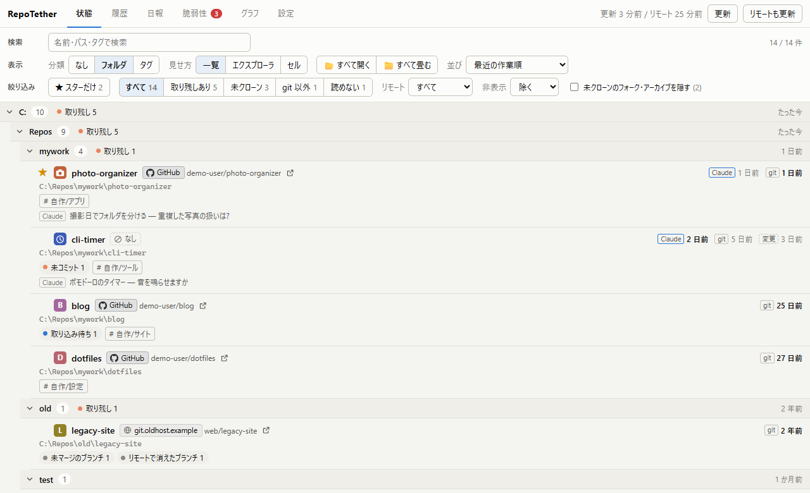

**タグ** は、タグの無いものを末尾の「タグなし」に入れます。タグの付け替え・並べ替えのドラッグは「タグ × 一覧」でだけ使えます。

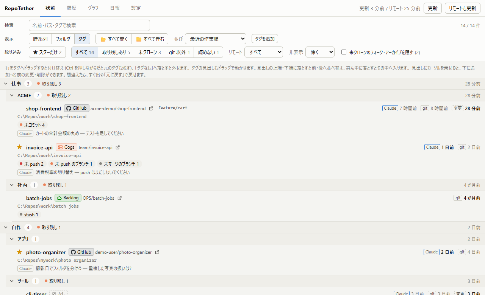

一覧では、各階層の見出しに件数・取り残しの数・最新の作業の時刻が出ます。見出しを押すと畳めます (畳んだ状態は覚えます)。

**エクスプローラ** は、Windows のエクスプローラのように、左に分類の木、右に選んだ階層の中身を表で出します。
分類が「なし」のときは木を出さず、すべてを 1 枚の表にします (取り残しの重さや最新の作業で並べ替えて見比べるのに使う)。

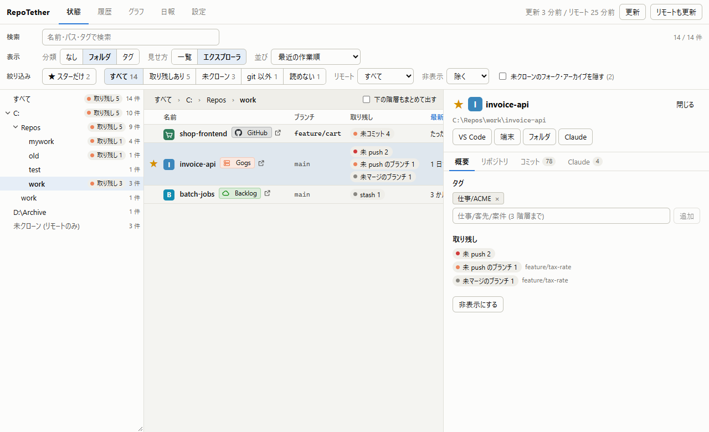

| 場所 | 中身 |
|---|---|
| 左の木 | 階層ごとに「取り残し N」(取り残しのあるプロジェクトの数。無ければ出ない) と「N 件」(下の階層も含めたプロジェクトの数)。押すとその階層を右に出す。右端をドラッグすると幅を変えられる |
| 右上 | 今の階層までの道筋。押すと上の階層へ戻る |
| 下の階層もまとめて出す | 選んだ階層の下にあるプロジェクトを、階層を分けずにすべて並べる。「場所」の列に親フォルダが出る |
| 表 | 先に下の階層 (▸ の行、押すと中へ)、続けてプロジェクト。列の見出し (名前 / 取り残し / 最新の作業) を押すと並べ替え |

プロジェクトの行を押すと、右に詳細パネルが出ます。行にカーソルを乗せると、右端に **VS Code / 端末 / フォルダ / Claude** のボタンが出ます。
検索と絞り込みは、一覧と同じように効きます。

### タグ

タグは `仕事/客先/案件` のように `/` で区切って 3 階層まで付けられます。1 つのプロジェクトに複数付けられます。

- **付ける** — 詳細パネルの「概要」で入力して追加。既存のタグが候補に出ます
- **親と子を両方は持たない** — `自作/アプリ` があれば `自作` は付けません (子のタグが親も表しているため)
- **タグ表示でドラッグ** — 行をタグの見出しへドラッグすると付け替え。Ctrl を押しながらだと元のタグも残します。
  「タグなし」へ落とすとタグを外します
- **タグ自体を管理** — 見出しにカーソルを乗せると「＋ 下に追加」「名前を変更」「削除」が出ます。
  見出しをドラッグすると、落とす位置で動きが変わります。

  | 落とす位置 | 動き |
  |---|---|
  | 見出しの上端 | そのタグの**前**へ (同じ階層で並べ替え)。青い線で示す |
  | 見出しの下端 | そのタグの**後**へ (同じ階層で並べ替え)。青い線で示す |
  | 見出しの真ん中 | そのタグの**中**へ (下の階層へ)。見出しを枠で囲む |
  | 「タグなし」 | 一番上の階層へ |

- 削除すると、付いていたプロジェクトは親のタグへ移ります (一番上なら「タグなし」)。件数を確認してから消します
- 作ったタグは、プロジェクトが無くなっても削除するまで残ります。並びは自分で並べた順です

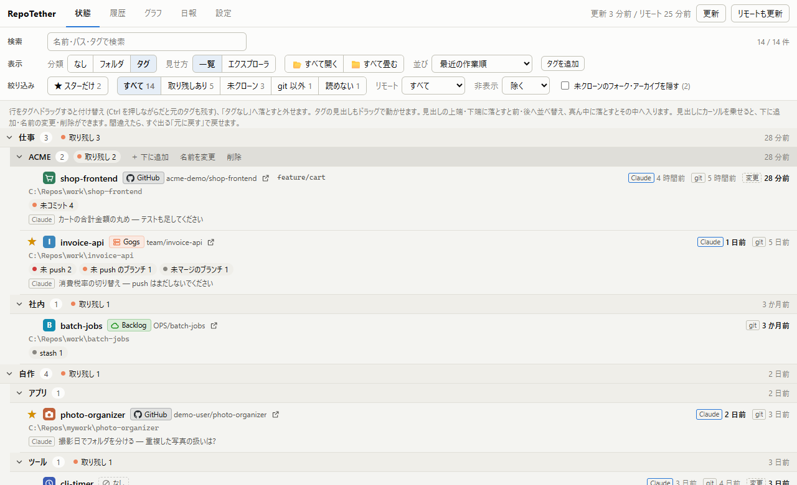

### スターと非表示

- **スター** — ☆ を押して ★ に。「★ スターだけ」で絞れます
- **非表示** — 行の「非表示」か、詳細パネルの「非表示にする」。状態タブの「非表示: だけ」で見られ、「表示に戻す」で戻せます。
  非表示のものは履歴・グラフ・日報に出ません

### 詳細パネル

行を押すと右に開きます。上部の名前・パス・VS Code / 端末 / フォルダはタブを切り替えても残ります。
最後に開いたタブを覚えるので、別のプロジェクトを選んでも同じタブが開きます。

| タブ | 中身 |
|---|---|
| 概要 | タグ、関連ページ (下を参照)、取り残しの詳細、非表示にする |
| リポジトリ | 現在のブランチ・追跡先・既定のブランチ・最後の fetch、注意が要るブランチの表、リモート |
| コミット | 自分のコミット (「他の人の分も」で全員分)。取り込み期間 (既定 365 日) を出し切ったら「次の 10 件を読む」で、それより前も読める |
| Claude | 「ログの検査」([下を参照](#ログの検査))と、セッションの一覧 (タイトル・時間・プロンプト数・ブランチ・最初と最後のプロンプト・最後の返答)。「全文」で会話の全文、「再開」で続きから ([Claude のセッションを開く](#claude-のセッションを開く)) |
| 脆弱性 | LockWatch の結果 ([下を参照](#脆弱性-lockwatch))。設定で LockWatch の場所を決めたときだけ、手元にあるリポジトリに出る |
| README | リポジトリ直下の README (日本語版があれば優先)。無ければタブが出ない |

**関連ページ** — そのプロジェクトで使うサービスの管理画面やドキュメント (Resend・Cloudflare・Firebase・GitHub のページなど) を登録しておけます。
URL を入れる (貼る) とページのタイトルを取ってきて名前の欄に入れるので、必要なら直して「追加」を押します。名前を押すとブラウザで開きます。
ログインが要るページはログイン画面のタイトルしか取れないので、そのときと取れなかったときはホスト名 (`dash.cloudflare.com` など) が入ります。
登録はすぐに保存されます (設定ファイルに、プロジェクトごと)。
名前の左にはサイトのアイコン (favicon) が出ます。一度取ったものはキャッシュのフォルダ (`favicons`) に残し、次からはネットワークにつなぎません。取れないサイトは丸印になります。
「編集」を押すと、名前・URL の書き換え、並べ替え (↑ ↓)、外すができます。「保存」を押すまで反映されず、「やめる」で元のままになります。

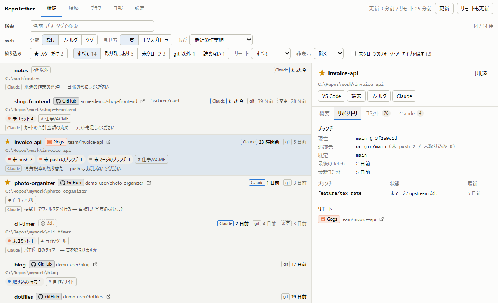

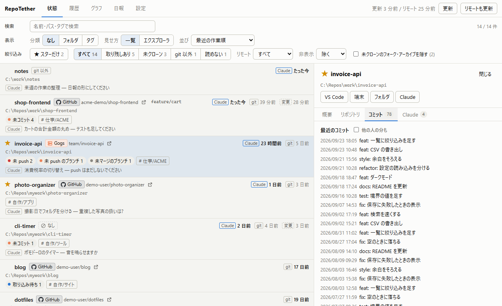

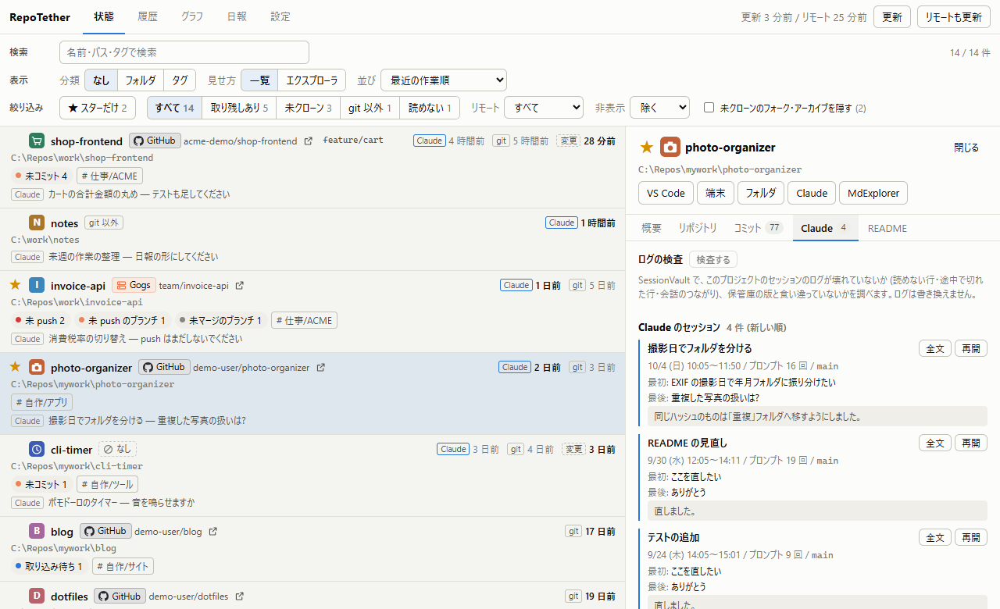

README は Markdown を整形して表示します。リンクはアプリ内ではなくブラウザで開きます。
他人の README に埋め込まれたスクリプトは実行しません (無害化してから表示)。

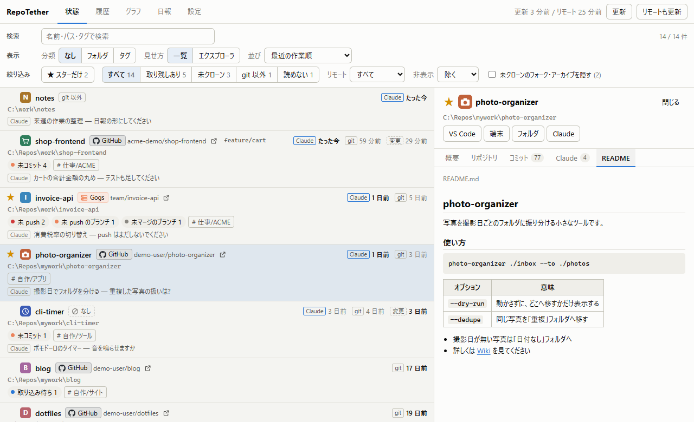

### Claude のセッションを開く

詳細パネルの「Claude」タブと履歴タブから、セッションを開けます。

| 操作 | 働き |
|---|---|
| タイトル / 「全文」 | 会話の全文を開く。自分の発言と Claude の返答 (Markdown を整形)、使ったツールの名前を並べる。ツールの結果・考えている途中・サブエージェントの分は省く。「この会話を検索」で絞れる。Esc で閉じる |
| 再開 | 設定で選んだ端末で、セッションを始めたフォルダを開き、`claude -r <セッション ID>` で続きから始める |
| 分岐して再開 | 元の会話は残して、別の会話として続ける (`--fork-session`)。全文の画面にある |

履歴タブでは、セッションの行にカーソルを乗せると「再開」が出ます。
SDK などからの自動実行のセッションには「再開」を出しません。端末に WSL を選んでいる場合は、
WSL の中の claude は Windows 側のセッションを知らないので、コマンドプロンプトで再開します。

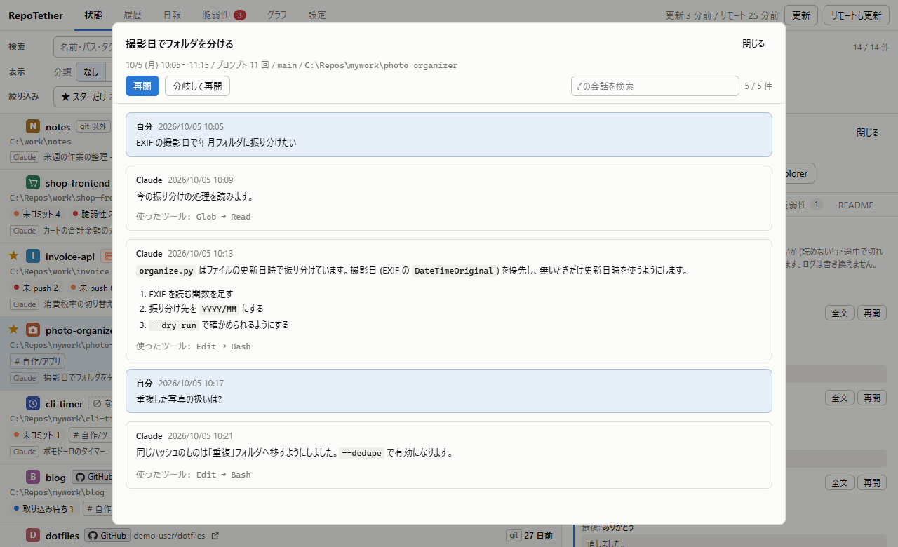

### ログの検査

Claude タブの「検査する」で、そのプロジェクトのセッションのログを SessionVault の `verify` で調べます。
SessionVault は Claude Code のログを別の場所 (保管庫) に残し、壊れたものを検査・修復する別の道具で、
RepoTether からは検査だけを呼びます (ログは書き換えません)。全部のログを読むので数秒かかります。

| 表示 | 意味 |
|---|---|
| 読めない行 (エラー) | JSON として読めない行がある |
| 会話のつながりが切れている (エラー) | 親の記録がどこにも無い行がある |
| 保管庫の版と食い違う (エラー) | ログが保管庫の版より短くなった、または書き換わった |
| 最後の行が途中まで (警告) | 書き込みの途中で止まった。Claude Code が今そのセッションに書いているときにも出る |
| 同じ記録が 2 回 (警告) | Claude Code が同じ記録を書き直したもの。害は無い |
| Claude Code から消えた (情報) | 保管庫には残っているが、元のログは消えている (保存期間を過ぎたなど) |

直すときは SessionVault の `repair` / `restore` を、そのセッションを Claude Code で開いていないときに使います。
サブフォルダで始めた会話は別の場所にログがあるので、そのプロジェクトに振り分けたセッションの場所をすべて調べます。

### 脆弱性 (LockWatch)

LockWatch は、リポジトリの lock ファイル (package-lock.json・pnpm-lock.yaml・uv.lock・Cargo.lock など) を
osv-scanner にかけて、使っているパッケージの脆弱性を調べる別の道具です (入れなくても RepoTether は使えます。
入手と入れ方は [LockWatch](https://github.com/lancard-aikawa/LockWatch))。設定の「脆弱性」タブで LockWatch の場所を決めると、
RepoTether は次のことをします。

- 更新のたびに、手元のリポジトリの一覧を LockWatch に渡す (LockWatch のデータの `targets.json`。中身が変わったときだけ書く)。
  非表示にしたリポジトリは渡さない
- LockWatch の結果を、詳細パネルの「脆弱性」タブと、一覧の行の「脆弱性 N」(緊急・高の数) に出す
- 「脆弱性」タブの「今すぐ調べる」で、そのリポジトリだけを LockWatch で照合し直す (全体は LockWatch の定期実行に任せる)。
  先に、前回の照合から lock ファイルと脆弱性 DB が変わったかを確かめ、変わっていなければ照合せずにそう知らせる。
  「この結果のまま」で閉じるか、「もう一度照合する」で前回の結果を使わずに照合し直す (そのあとに公表された脆弱性も拾う)

**非公開のリポジトリのパッケージ名は外に出しません。**一覧を渡すときに、リポジトリごとに公開・非公開を付けます。

| 付けるもの | 条件 | LockWatch の照合 |
|---|---|---|
| 公開 | 主なリモート (`origin`) が github.com にあり、リモートの一覧で公開 | オンライン (api.osv.dev) |
| 非公開 | リモートのどれかが一覧で非公開。または Gogs・Gitea などの自前のサーバーにある (そこで公開でも、社内などの中での公開なので) | 手元の脆弱性 DB |
| 不明 | リモートが無い・リモートの一覧に無い (一覧をまだ取っていない、アカウントを登録していないなど) | 手元の脆弱性 DB |

タブの中身:

| 表示 | 意味 |
|---|---|
| 緊急 / 高 / 中 / 低 / 不明 | 深刻度。GitHub の勧告の区分があればそれを、無ければ CVSS の点数から。どちらも無ければ不明 |
| 保守終了・安全性の欠陥・お知らせ | 脆弱性ではない知らせ (RustSec の unmaintained / unsound / notice)。保守終了は、そのパッケージがもう直されないという意味 |
| 悪意あるコード | 悪意あるコードとして報告されたパッケージ (OSV の `MAL-` の記録)。深刻度は緊急になる。その版を入れた環境は、侵害されたものとして扱う |
| 新しく出た | LockWatch の前回の照合には無かったもの |
| 注意 N | 脆弱性の照合とは別に、LockWatch が lock ファイルそのものを読んで分かったこと。版を固定していない (`requirements.txt` の `>=1.0` など。照合が不正確か、行われていない)、レジストリ以外から取得 (URL・git)、ハッシュなし、公開直後の版 (公開から 7 日たっていない)。「隠す」は効かない |
| ID | 押すと osv.dev で詳しい説明を開く |
| 直る版 | この版以上に上げれば直る |
| 隠す | 深刻度や知らせの種類ごとに隠す。この PC で覚え、一覧の行の「脆弱性 N」にも効く |

lock ファイルの無いプロジェクト (package.json だけなど) は調べられません。

### 未クローンとクローン

リモートにだけあるリポジトリは「未クローン」で絞れます。push の時刻は **push** のラベルで出ます。
フォークとアーカイブ済みには印が付き、「未クローンのフォーク・アーカイブを隠す」で隠せます
(クローンして作業しているフォークは隠しません)。

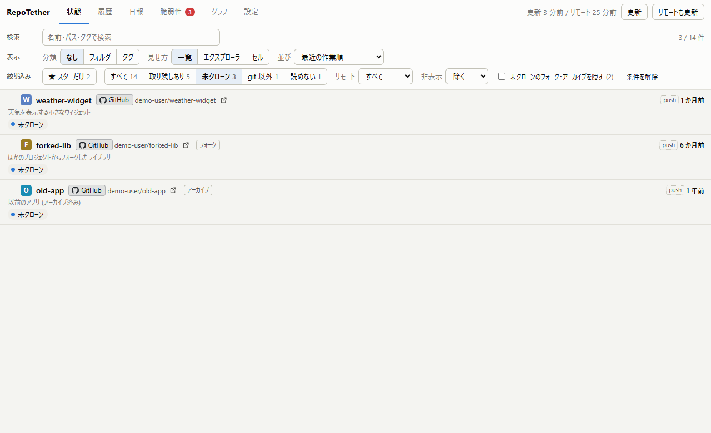

「クローン」で、URL (HTTPS / SSH)・親フォルダ・フォルダ名を選んでクローンします。
親フォルダが探す場所の外なら、探す場所に足すかを選べます (足さないと次の更新で一覧に出ません)。

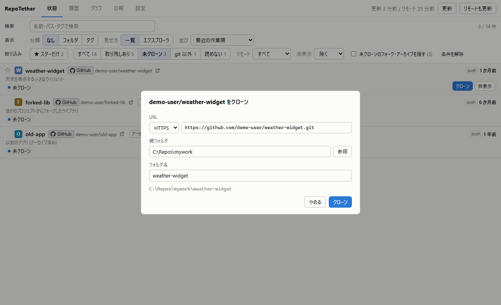

---

## 5. 履歴・グラフ・日報タブ

### 履歴

コミットと Claude セッションを、日 → プロジェクトの順にまとめて並べます。
期間 (今日 / 7 / 14 / 30 / 90 日)・プロジェクト・検索・種類 (コミット / Claude)・自分のコミットだけ、で絞れます。

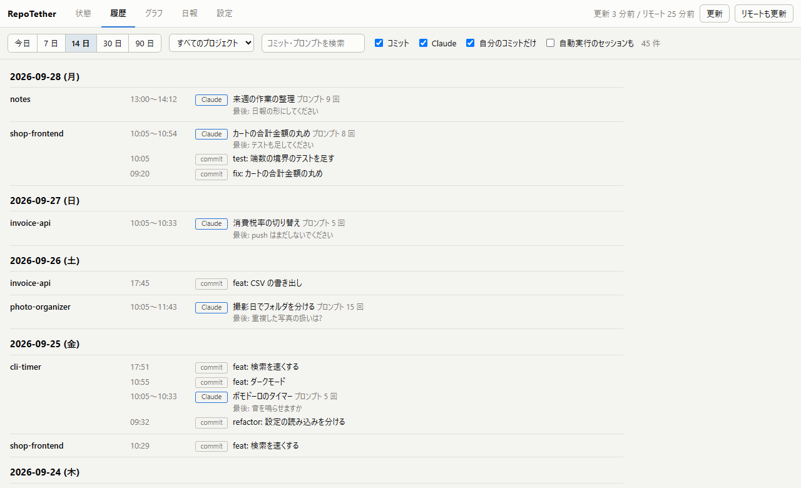

### グラフ

| 図 | 中身 |
|---|---|
| 数字 | 今週触ったプロジェクト、今週の自分のコミット、今週の Claude へのプロンプト、取り残しのあるプロジェクト |
| 日ごとの活動 | 過去 1 年のカレンダー (GitHub の草のようなもの) |
| 週ごとの活動 | 過去 26 週の棒 |
| プロジェクトごとの活動 | プロジェクト × 週。最近触った順 |
| 止まっているプロジェクト | 5〜12 週前には触っていて、直近 4 週は触っていないもの |

「合計 / コミット / Claude」で数えるものを切り替えます。マス・棒にカーソルを乗せると件数が出ます。

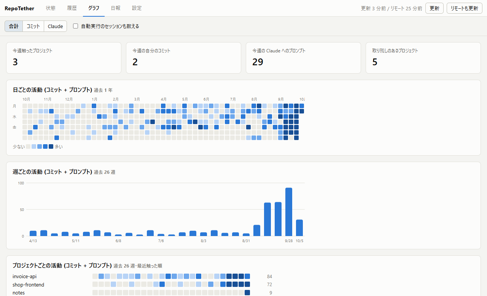

### 日報

日報 (1 日) か週報 (7 日) の Markdown を作ります。プロジェクトごとに作業した時間帯・コミット・Claude とのやりとりを並べ、
「残っていること」(触ったプロジェクトの取り残し) と「Claude の最後の返答」も入れられます。

- 表示は「編集 / 並べて表示 / プレビュー」。手で直した内容もそのままプレビューに出ます
- 日付や条件を変えると作り直します。手直し中に裏で更新があっても上書きしません (「作り直す」で反映)
- 「コピー」でクリップボードへ、「保存」で `.md` に保存します

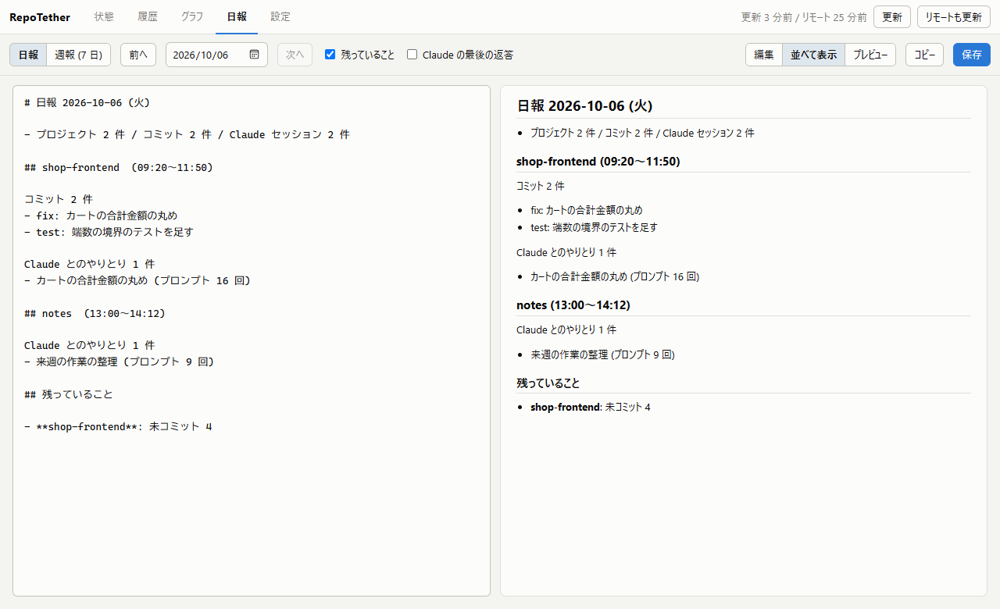

---

## 6. 設定タブ

「保存して更新」「元に戻す」はタブの外の上部にあり、どのタブからでも押せます。
保存していない変更があるタブには青い点が付きます。
設定はどれも、保存を押すまで反映されません (テーマ・端末・自動更新などの表示の設定や、Claude Code のログの保存期間も同じ)。
表示の設定と保存期間だけを変えたときはボタンが「保存」になり、リポジトリの読み直しはしません。

### 探す場所

リポジトリを探すフォルダ、探す深さ (既定 3 階層)、コミットを読む期間 (既定 365 日)、
Claude のセッションで使ったフォルダも対象にするか。

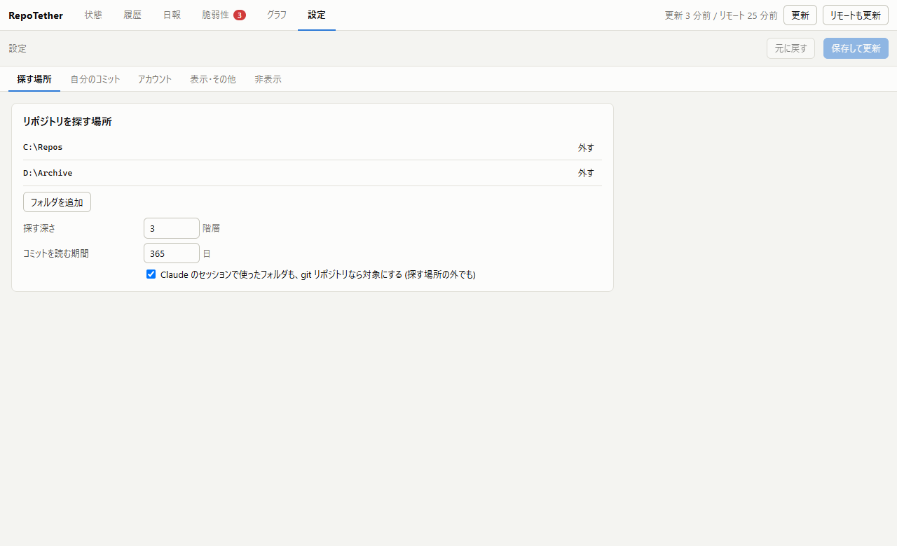

### 自分のコミット

履歴・グラフ・日報で数える、自分のメールアドレス。コミットに出てくるアドレスが件数付きで候補に出ます。

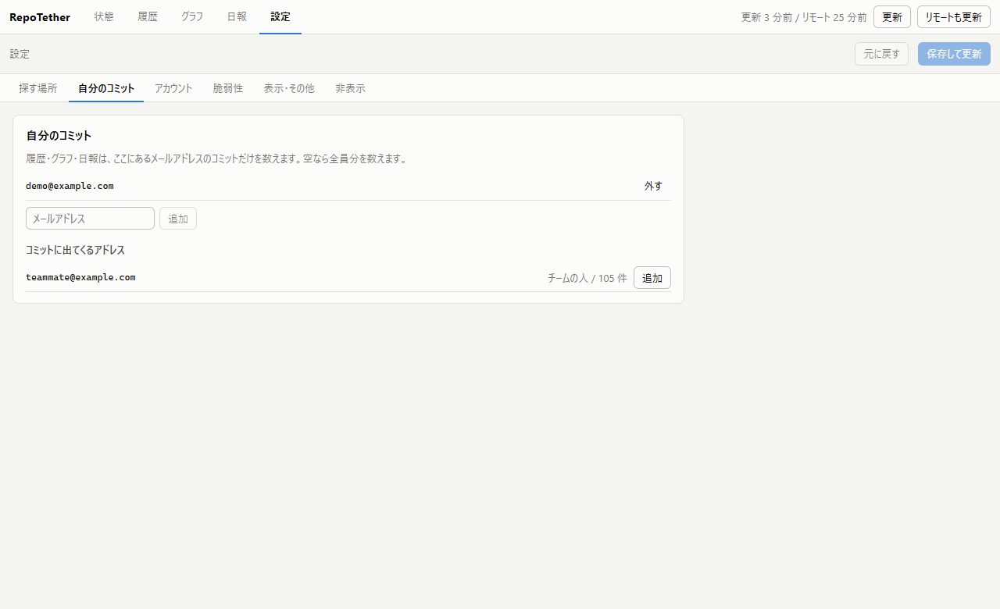

### アカウント

GitHub / Gogs / Gitea を足します。

| 種類 | 認証 |
|---|---|
| GitHub | **gh コマンドのログインを使う (おすすめ)** — 一覧を取るたびに `gh auth token` でトークンを受け取り、保存しない。ログインは `gh auth login --web`。「確認」でログイン中のアカウントを表示 |
| GitHub | トークン — 資格情報マネージャーに保存。無ければユーザー名の公開リポジトリだけ |
| Gogs / Gitea | トークン (Gogs は必須)。「ユーザー設定 → アプリケーション」で作る |

トークンは画面に表示せず「保存済み」とだけ出ます (「入れ直す」「消す」)。
資格情報マネージャーに手で登録する場合は、「資格情報マネージャーでの名前」(`RepoTether:<アカウント ID>`) を
インターネットまたはネットワークのアドレスに、トークンをパスワードに入れます。

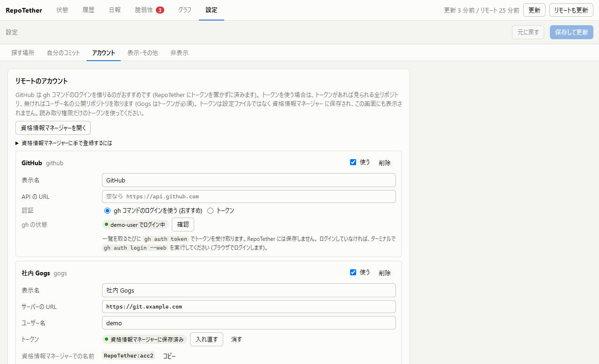

### 脆弱性

LockWatch ([脆弱性 (LockWatch)](#脆弱性-lockwatch)) を使うかを決めます。

| 項目 | 中身 |
|---|---|
| LockWatch の場所 | LockWatch のフォルダ。空なら使わない。そのフォルダの `.venv` の Python (無ければ PATH の Python 3.11 以上) で動かす。受け渡しのファイルの場所は LockWatch 自身の設定に従う |
| 確かめる | 入力した場所で LockWatch が使えるかを見る (保存前でもよい)。LockWatch の版、osv-scanner の有無と版、受け渡しのファイルと件数、最後の照合、手元の脆弱性 DB、定期実行が登録されているかを出す。タブを開いたときにも自動で確かめる |
| LockWatch を開く | LockWatch の画面 (状態・結果・台帳・設定) を開く (LockWatch 0.2.0 からの `lockwatch gui`。古い LockWatch では押せない)。「台帳」では、どのリポジトリがそのパッケージのどの版を使っているかを引ける。LockWatch の設定 (公開リポジトリをオンラインで照合するか、データの場所など) はそこで変える。変えたら戻ってきて「確かめる」を押す |

osv-scanner が無いときと、定期実行が登録されていないときは、入れるコマンド・登録するコマンドを出します (「コピー」でコピー)。
詳細パネルの「脆弱性」タブにも同じ案内と、このタブを開くボタンが出ます。場所が空のときは、使い始めるまでの手順を出します。

### 表示・その他

| 項目 | 中身 |
|---|---|
| クローン先の親フォルダ | クローンのダイアログの既定 |
| Claude のログの場所 | 空なら `%USERPROFILE%\.claude\projects` |
| SessionVault の場所 | 「ログの検査」で使う SessionVault。**Claude History Viewer のフォルダ**か `sessionvault.exe` を指定する。空なら PATH の sessionvault.exe。Viewer のフォルダなら、Viewer に同梱の SessionVault を Python (3.10 以上) で動かし、Viewer の設定 (`sessionvault_src` / `sessionvault_config`) に合わせて Viewer と同じ保管庫を見る。exe なら、保管庫の場所は exe の隣の `sessionvault.json` に従う |
| 外部ツール | プロジェクトのフォルダを渡して起動するプログラム (いくつでも)。名前・プログラムの場所・引数を入れて保存すると、VS Code / 端末 / フォルダ / Claude のボタンの横に、その名前のボタンが並ぶ。引数の `{path}` がフォルダのパスになり、引数が空ならフォルダのパスだけを渡す (例: fastmd-explorer は `fastmd-explorer.exe` を指定するだけ)。シェルは通さず、作業フォルダはそのプロジェクトのフォルダ |
| Claude Code のログの保存期間 | Claude Code の `cleanupPeriodDays` (下を参照)。保存したときに書き込む |
| テーマ | OS に合わせる / ライト / ダーク (タイトルバーも合わせる) |
| 一覧の密度 | 標準 / コンパクト (行を詰め、Claude の一行要約を省く) |
| 端末 | 「端末」ボタンで開くもの。この PC で見つかったもの (Windows Terminal / PowerShell 7 / Windows PowerShell / コマンドプロンプト / Git Bash / WSL) から選ぶ |
| 自動更新 | ローカル (既定 15 分) とリモート (既定 60 分) の間隔。ウィンドウが見えていないあいだは止める |
| 読み直す範囲 | 自動更新と起動時に git から読み直すもの。既定は「最近 90 日に作業したもの」(30 / 90 / 180 / 365 日、すべて)。作業 = ローカルの最新コミット・未コミットのファイルの更新・そのフォルダでの Claude のセッション。古いものでも、コミット・切り替え・pull・push・stash・ブランチの作成や削除など git の操作があれば読み直す。ほかは前回の結果を使う。git を使わずにファイルだけを書き換えた古いリポジトリは、手動の「更新」まで反映されない |
| git fetch | リモートを更新するとき、各リポジトリで `git fetch --all --prune` もする (既定はしない)。認証の画面は出さず、1 つ 20 秒で打ち切る |
| 自動実行のセッション | SDK などからの自動実行のセッションも活動に数えるか |

表示の設定 (テーマから下) はこの PC だけのものです。ほかの設定と同じく、保存を押すと反映されます。

**Claude Code のログの保存期間** — Claude Code は、保存期間 (既定 30 日) より古いセッションのログを起動時に消します。
消えたセッションは RepoTether の履歴・グラフ・日報・会話の全文からも消えるので、長く残したいなら延ばしてください
(既定 / 90 日 / 180 日 / 1 年 / 10 年 / 日数を指定)。書き換えるのは Claude Code の設定ファイル
(`%USERPROFILE%\.claude\settings.json`、`CLAUDE_CONFIG_DIR` があればそこ) の `cleanupPeriodDays` だけで、
ほかの項目は中身も並び順も変えません。「既定」を選ぶと項目を消して既定に戻します。
効くのは次に起動する Claude Code からで、すでに消えたログは戻りません。

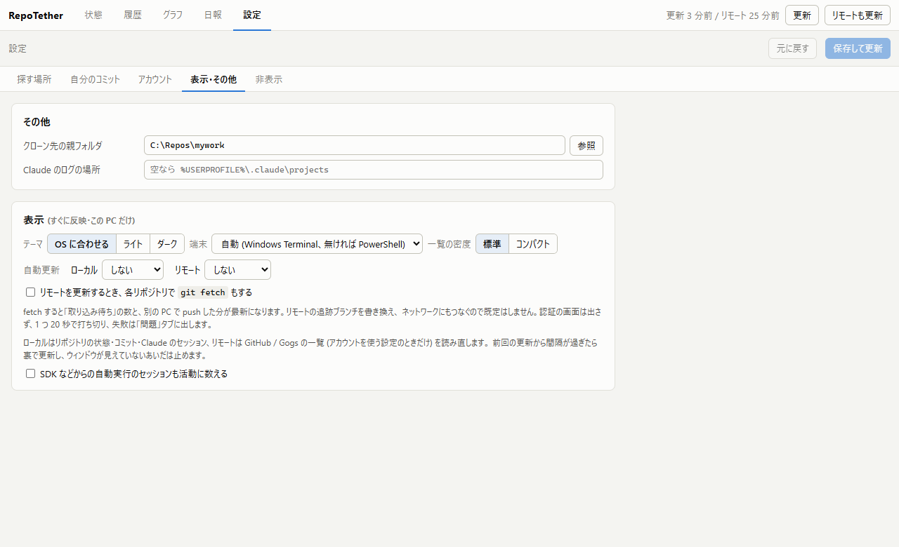

ダークテーマとコンパクト表示:

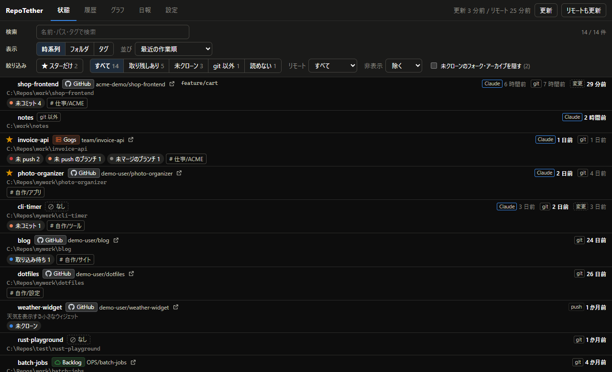

### 非表示・問題

- **非表示** — 非表示にしたプロジェクトの一覧。「戻す」で戻せます
- **問題** — 取り込みで問題があったときだけ出ます (探す場所が無い、リモートの取得に失敗、fetch に失敗など)

---

## 7. よくある作業

### 取り残しを片付ける

1. 状態タブで「取り残しあり」を押し、並びを「取り残し・放置が長い順」にする
2. 上から、バッジを見て片付ける (VS Code / 端末で開いてコミット・push など)
3. 「更新」で読み直すとバッジが消える

別の PC で push した分や「取り込み待ち」を正しく出すには、「表示・その他」で git fetch をオンにして「リモートも更新」を押します。

### 日報を書く

1. 日報タブを開く (今日の日付)
2. 「並べて表示」で、左を手直ししながら右で仕上がりを見る
3. 「コピー」して貼る、か「保存」

### 数年前のリポジトリの経緯を見る

詳細パネルの「コミット」で、取り込み期間より前も「次の 10 件を読む」で遡れます。

### Claude との作業の続きをする

1. 状態タブで、右端の時刻に **Claude** が太字で出ているプロジェクト (最後の作業が Claude とのやりとり) を探す
2. 行を押して詳細パネルの「Claude」タブを開き、「全文」でどこまで進んだかを読む
3. 「再開」で、端末でその会話の続きから始める。新しく始めるなら行の「Claude」

### 触っていないリポジトリを整理する

グラフタブの「止まっているプロジェクト」を見て、要らないものは状態タブで非表示にするか、タグ (例: `保管`) を付けて畳みます。

---

## 8. データの置き場所

| もの | 場所 |
|---|---|
| 設定 (探す場所・アカウント・タグ・スター・非表示など) | `%APPDATA%\com.repotether.app\config.json` |
| トークン | 資格情報マネージャーの汎用資格情報 `RepoTether:<アカウント ID>` |
| 取り込み結果・セッション要約のキャッシュ | `%LOCALAPPDATA%\com.repotether.app\` |
| 表示の好み (タブ・テーマ・密度・端末・自動更新など) | アプリ内の保存領域 (この PC だけ) |

設定ファイルが壊れて読めないときは、`config.broken.json` に退避してから既定値で起動します。
アンインストールしても設定とキャッシュは残るので、要らなければ上のフォルダを消してください。

`run-repotether.bat` (ソースからのビルド) で使っていた PC にインストール版や zip 版を入れても、保存先は同じなので
設定・トークン・キャッシュ・表示の好みはそのまま引き継がれます。両方を同時に起動すると同じ設定ファイルを書き合うので、
片方を閉じてから起動してください。`run-repotether.bat dev` で使っていたときの表示の好みだけは、保存領域が別なので引き継がれません。

---

## 9. 困ったとき

| 症状 | 対処 |
|---|---|
| 起動すると SmartScreen が止める | 署名していないため。「詳細情報」→「実行」 |
| 初回の読み込みが遅い | Claude Code のログをすべて読むため (30 秒ほど)。2 回目からは前回の要約を使うので数秒 |
| 「所有者チェックで読めない」 | 別のドライブなどで、git がフォルダの所有者を確認できない。自分のフォルダなら、詳細パネルの「safe.directory に追加」(`git config --global --add safe.directory <パス>`) |
| 「読めない」 | `.git` が壊れているなど。git で直接確かめる |
| 自分のコミットが数えられない | 「設定 → 自分のコミット」にアドレスが無い。GitHub の Web でのコミットは noreply のアドレス |
| GitHub の一覧が取れない (gh) | 「設定 → アカウント」の「確認」でログイン状態を見る。未ログインならターミナルで `gh auth login --web` |
| Gogs が 403 になる | Gogs はトークンが必須。トークンを入れて保存 |
| 取り込み待ちの数が古い | fetch していないため。「表示・その他」で git fetch をオンにして「リモートも更新」 |
| fetch が「問題」に出る | 接続できない・認証が要るリモート。認証の画面は出さない作りなので、ターミナルで一度 `git fetch` して資格情報を保存する |
| VS Code で開けない | VS Code が見つからない (`code` が PATH に無い、既定の場所に無い)。VS Code を入れ直すか、PATH を確かめる |
| クローンしたのに一覧に出ない | クローン先が探す場所の外。クローンのダイアログで「探す場所に追加」するか、「設定 → 探す場所」で足す |
| タグを間違えて動かした | 直後のお知らせの「元に戻す」。時間が経っていれば、見出しを上端・下端・真ん中へドラッグし直す |
| 「再開」で「No conversation found」と出る | セッションを始めたフォルダが移動・削除された。Claude Code はフォルダごとにセッションを記録するので、元のフォルダでないと再開できない |
| 「再開」「Claude」で端末は開くが claude が動かない | `claude` が PATH に無い。端末で `claude --version` が動くか確かめる |
| 会話の全文が「見つかりません」 | ログが消されたか、別の PC のセッション (履歴は取り込み時の要約から出している) |
| 「ログの検査」で「sessionvault.exe が見つかりません」 | 「設定 → 表示・その他」の「SessionVault の場所」に Claude History Viewer のフォルダか sessionvault.exe を指定する |
| 「Viewer の SessionVault がありません」 | Viewer をサブモジュールなしで取ってきた。Viewer のフォルダで `git submodule update --init` を実行する (Release の zip なら同梱されている) |
| 「Python が見つかりません」 | Viewer のフォルダを指定したときは Python 3.10 以上が要る。入れるか、sessionvault.exe を指定する |
| 「ログの検査」で「保管庫の版と食い違う」が出ない・「消えた」が出ない | sessionvault.exe が保管庫を見つけていない。exe の隣で `sessionvault.exe config set vault <保管庫>` を実行する |
| 1 か月より前の Claude の履歴が無い | Claude Code が既定で 30 日より古いログを消すため。「表示・その他」の「Claude Code のログの保存期間」を延ばす (消えた分は戻らない) |

---

## 10. 開発者向け: 画像の撮り直し

このマニュアルの画像は、架空のプロジェクトを並べたデモ環境で撮っています。

```sh
pnpm install
pnpm manual-shots      # docs/images/ に撮る (開発サーバーが動いていなければ起動して、終わったら止める)
```

`tools/manual-shots.mjs` がデモのデータ (プロジェクト・コミット・Claude のセッション・設定) を毎回作り、
ブラウザ表示 (`pnpm dev`) を Windows の Microsoft Edge で開いて撮ります。実在のリポジトリやプロンプトは使いません。
